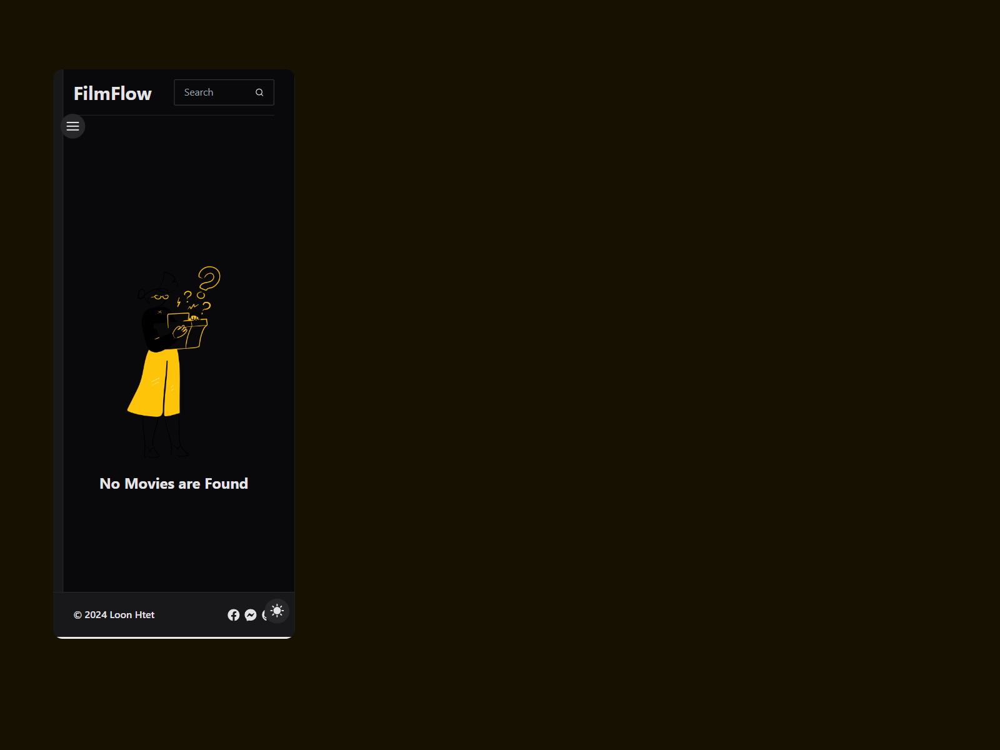

# Hi there 👋, I'm Loon Htet

I'm writing a web app that provides users with a fantastic search feature for searching movies. The app is built with React, Tailwind CSS, and integrates with the OMDB API for movie data.

## Features

- Light/dark mode toggle.
- Fully Responsive on any devices.
- Fantastic Search Feature.
- Fast Performance.

## Technologies Used

- **React**: I used React for my web app interfaces.
- **Tailwind CSS**: Tailwind is for styling and it is fantastic CSS framework
- **OMDB API**: This is my first time of using this API and it is very suitable to get information for movies
